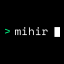

# Mihir Belose

I'm a Computer Science junior at UW–Madison, also studying Data Science and Economics. I'm drawn to autonomous systems, native apps, and creative uses of AI. I enjoy exploring unfamiliar technology and working through the details that make an idea useful.

## Things I've built

###  [HeyDay News](https://heyday.news)

An AI-operated news network that follows stories from source discovery and research through cited articles, narrated broadcasts, short videos, and publication across platforms. The interesting engineering is in the long-running workflows: durable jobs, recovery, editorial review, and keeping each publishing destination independent.

###  [Skinshi](https://www.skinshi.com/)

A native iOS app for browsing CS2 inventory, organizing Storage Units, checking market prices, and trading through Steam. It talks to Steam directly and reconciles item moves against Steam-confirmed state.

###  [Mirage](https://getmirage.dev)

An iPad HDMI monitor built around UVC capture, with responsive video preview, audio passthrough, resolution switching, and screenshots.

###  [LinkQT](https://linkqt.me)

A place to claim a personal name and publish a page, whether you write the HTML yourself or build it with AI. [Code](https://github.com/heydaytime/linkqt)

## Code you can explore

###  [Blendr](https://github.com/heydaytime/blendr)

Chrome extension and browser viewer for synchronized YouTube watch parties. [Try it](https://www.blendr.live/)

###  [huh](https://github.com/heydaytime/huhcli)

A local Ollama-powered shell assistant that helps fix the command you just broke.

### [Softcast](https://github.com/heydaytime/softcast)

Turns a browser on a spare screen into a remotely controlled fill light. [Try it](https://softcast.studio)

### [Qdrant RPI](https://github.com/heydaytime/qdrant-rpi)

An experimental Qdrant fork exploring trust-tiered vector search and promotion based on usage signals.

Outside of code, I make music, customize Linux, and [document projects on YouTube](https://www.youtube.com/@heydaytime).

[Website](https://mihirbelose.com) · [Projects](https://mihirbelose.com/projects) · [YouTube](https://www.youtube.com/@heydaytime) · [LinkedIn](https://www.linkedin.com/in/mihir-belose/)
